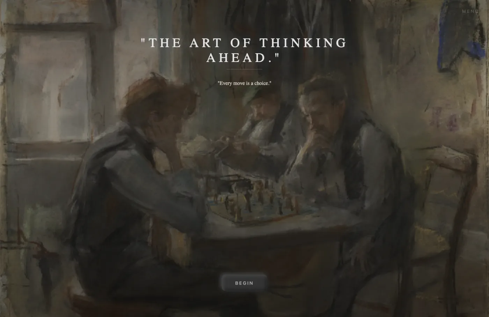
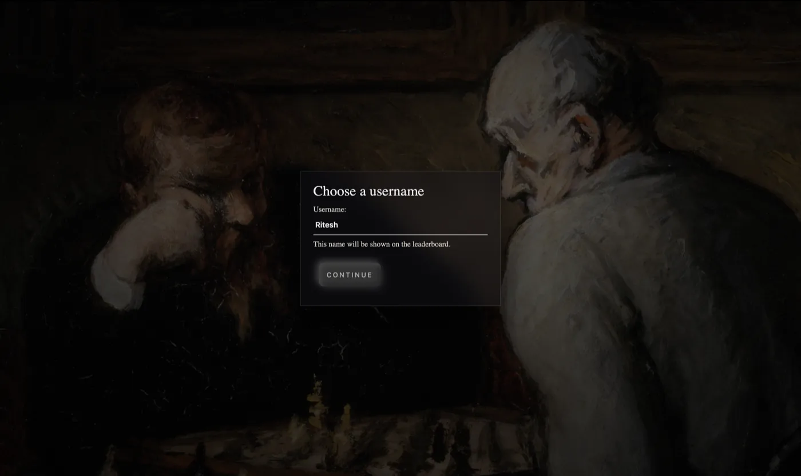
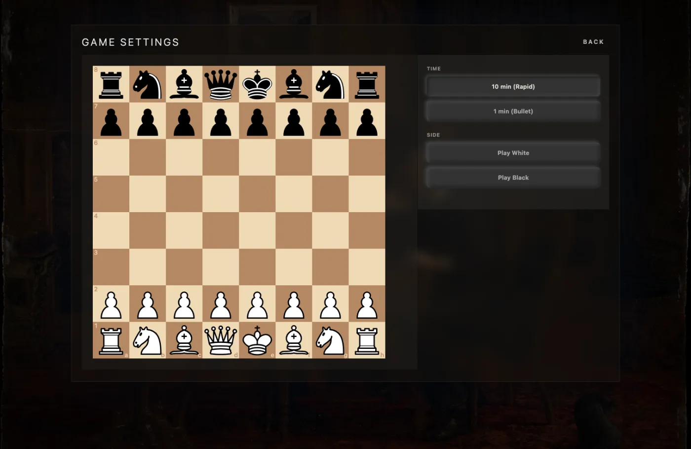
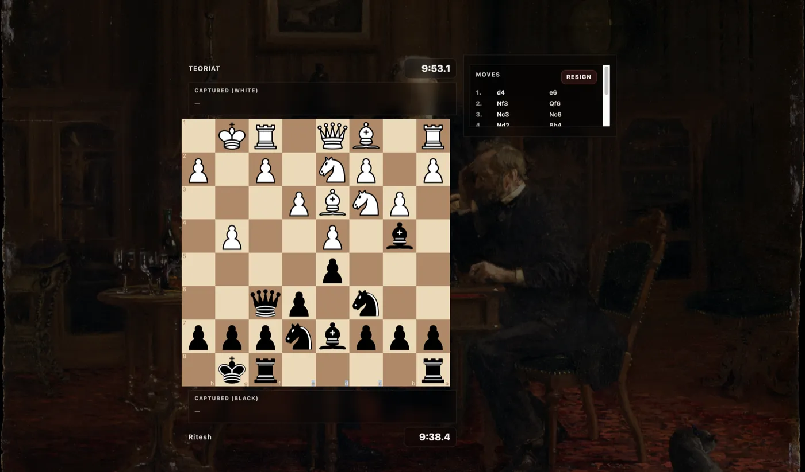
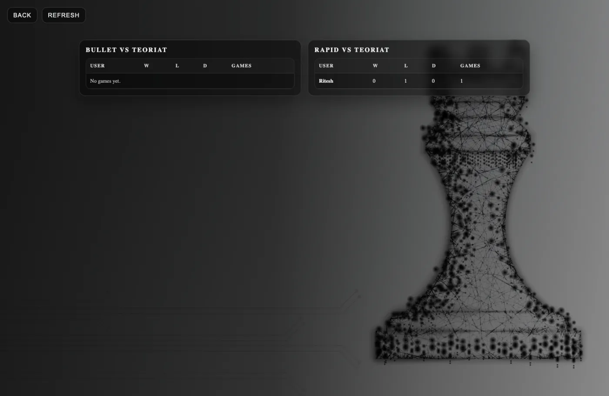

# TEORIAT Chess Engine

**TEORIAT** is a chess bot trained to imitate one player: the Chess.com account `teoriat`.
It does not try to play the best move. A small recurrent network predicts the move that player would likely make, a set of chess heuristics filters out the worst blunders, and the result is served through a web app you can play against.

Live app: https://chess-engine-two.vercel.app

---

## Table of Contents

* [Overview](#overview)
* [Architecture](#architecture)
* [Screenshots](#screenshots)
* [Modeling Approach](#modeling-approach)
* [Evaluation](#evaluation)
* [Data Pipeline](#data-pipeline)
* [Web Application](#web-application)
* [Local Development](#local-development)
* [Tests](#tests)
* [Deployment](#deployment)
* [Roadmap](#roadmap)

---

## Overview

`src/tables.py` downloads the `teoriat` game archives from the Chess.com public API (January 2023 to August 2025) into PostgreSQL. The training set exported from that database, `cleaned_data.csv`, holds **1,000 games** and **60,600 move-prediction examples**.

A PyTorch GRU is trained on those games to predict the next move from the last six plies. At play time a **FastAPI** backend combines the network's candidates with simple tactical checks and picks a move. A **React** frontend provides the board, clocks, move list and a leaderboard.

---

## Architecture

### Data Layer

* PostgreSQL database for raw games, per-move rows and mined opening patterns (training only)
* Python scripts and notebooks for extraction, cleaning and analysis

### Modeling Layer

* PyTorch GRU model for next-move prediction (`src/notebooks/RNN_model.ipynb`)
* Heuristic re-scoring and sampling at inference (`src/app.py`)

### Backend

* FastAPI app serving the trained model, plus a small SQLite leaderboard
* Endpoints:

  * `GET /` health check
  * `POST /move` TEORIAT's next move for a list of UCI moves
  * `GET /legal_moves` legal moves for a position
  * `POST /games` save a finished game result
  * `GET /leaderboard` per-player results by time control

### Frontend

* React single-page app (Create React App) deployed on Vercel
* `react-chessboard` for the board and `chess.js` for rules
* Talks to the backend through `REACT_APP_API_BASE`

---

## Screenshots







---

## Modeling Approach

### Problem Definition

Given the last six plies of a game, predict the next move as a class over the move vocabulary.

Training examples are built from **every** move in each game, both TEORIAT's and the opponent's. The network is only asked for a move when it is TEORIAT's turn. The model never sees the board itself, only the recent move sequence.

---

### Input Representation

Each example is the last `6` plies (`MAX_SEQ_LEN`), left-padded with a pad token when the game is shorter. Each ply has three features:

* `move_id`: index of the SAN move string in the vocabulary (`1,927` distinct moves plus one pad token = `1,928`)
* `color_id`: `1` if white played the move, `0` if black
* `teoriat_flag`: during training, `1` if TEORIAT played that move. The backend always sends `0` at inference (named `theory` in the code)

Each feature has its own embedding (`128`, `32` and `32` dimensions). They are concatenated into a `192`-dimensional vector and layer-normalised.

---

### Network Architecture

`ChessRNN` in `src/app.py` (`chessRNN` in the notebook):

* 2-layer GRU, `256` hidden units, dropout `0.3` between layers
* Dropout, fully connected `256 → 256` with ReLU, dropout, output layer with `1,928` logits

Training: cross-entropy loss, AdamW (learning rate `3e-4`, weight decay `0.01`), OneCycle schedule with max learning rate `1e-3`, batch size `64`, `25` epochs, gradient clipping at `1.0`.

---

### Move Selection at Inference

The network output is not played directly. For each request the backend:

1. Uses an opening book if `src/book.bin` exists. No book is included in this repository, so this step is skipped by default.
2. Takes the network's top `120` candidates that are legal in the current position, plus every legal capture, check and promotion.
3. Plays a checkmate immediately if one of the candidates gives mate.
4. Adds a heuristic score to each candidate: material won by captures, a bonus for checks, and penalties for leaving the moved piece hanging, for the opponent's best capture reply, and for repetition. The heuristic score is weighted `0.35` against the model's log-probability.
5. Samples the final move from the best `8` candidates with temperature `0.9`, so play is not fully deterministic.
6. Waits a minimum "think" time (`0.2 s` bullet, `0.6 s` rapid) before replying.

---

## Evaluation

The positions are split with `TimeSeriesSplit(n_splits=5)` in file order. Games in `cleaned_data.csv` are sorted by Chess.com game id, which is roughly chronological. The shipped checkpoint `src/best_chess_model.pth` was trained on the first 30,300 positions.

Accuracy of the raw network (before the heuristics and sampling above), measured with the shipped checkpoint:

| Positions | Role | Top-1 | Top-5 |
|---|---|---|---|
| 0 to 30,299 | training | 71.2% | 91.0% |
| 30,300 to 40,399 | validation | 11.1% | 23.7% |
| 40,400 to 50,499 | test | 12.0% | 24.9% |
| 50,500 to 60,599 | never used | 9.4% | 21.3% |

* On the test block, counting only TEORIAT's own moves: **12.8% top-1, 24.8% top-5**.
* With the flag set to `0` as the backend does: 11.5% top-1 on the test block.
* Baseline for comparison: always predicting the most common reply to the previous move (learned from the training block) gets **9.4% top-1** on the test block (10.2% on TEORIAT's moves).

So the network fits the training games closely but generalises only a little better than a simple lookup on unseen games.

**About the notebook's 72.4% / 91.8% "test accuracy":** that number is not a held-out result. The validation and test loaders use `SequentialSampler(val_indices)` and `SequentialSampler(test_indices)`. `SequentialSampler` iterates `0 … len-1` instead of the given indices, so both loaders scored positions 0 to 10,099, which are training data. Re-scoring those positions with the shipped checkpoint gives 71.3% / 91.5%. The same bug means the "best" checkpoint was chosen on training positions. Using `SubsetRandomSampler` or `Subset(dataset, indices)` for evaluation fixes it.

---

## Data Pipeline

### Database Schema (PostgreSQL, training only)

**`chess_games`**

* One row per game: players, ratings, PGN, end time, time class and control, rated flag, result and URL

**`game_moves`**

* One row per move:

  * `game_id`
  * `move_number`, `ply_number`
  * `player_color`
  * `move_san`
  * `is_teoriat_move`
  * `teoriat_color`

**`opening_patterns`**

* Opening move sequences with how often they occur

---

### Extraction and Cleaning

* `src/tables.py` creates the tables, downloads the monthly archives and fills `chess_games`, `game_moves` and `opening_patterns`
* `src/notebooks/Analysis.ipynb` reads the tables with SQLAlchemy, explores the data and writes `cleaned_data.csv`: `game_id`, `moves` as a list of `(color, SAN, is_teoriat_move)` tuples, `num_moves` and `first_move`
* `src/notebooks/RNN_model.ipynb` encodes the moves, builds the six-ply examples, trains the model and writes `best_chess_model.pth`

The notebooks and `src/tables.py` need extra packages that the API does not: install them with `pip install -r requirements-dev.txt`. They connect to Postgres using the standard `PGHOST`, `PGDATABASE`, `PGUSER` and `PGPASSWORD` environment variables (set `PGPASSWORD` yourself; there is no default).

---

## Web Application

### Backend (FastAPI)

Located under `src/`.

* Loads the model and move vocabulary at startup (`best_chess_model.pth`, `move_to_number.json`)
* Returns TEORIAT's next move for a move history
* Saves finished games and serves the leaderboard from a local SQLite file (`src/leaderboard.db`)
* `POST /games` is rate limited to 10 requests per minute per IP. Player names are trimmed and grouped case-insensitively. Nothing verifies that a submitted game was actually played

Runs with **Uvicorn** on **Render** (free instance) using the included Dockerfile.

---

### Frontend (React)

Located under `teoriat-chess/`.

Key screens:

* **Landing**
* **Username**: 2 to 20 characters, shown on the leaderboard
* **Game settings**

  * Time control: 10 min rapid or 1 min bullet
  * Side: white or black
  * Checks that the backend is awake before the game starts, so the clock does not run during a cold start

* **Game**

  * Board sized to the window
  * Clocks for both sides, move list, captured pieces and a resign button
  * Error message with retry if the engine request fails
  * Result dialog with rematch, and a retry if saving the result fails

* **Leaderboard**

  * Separate bullet and rapid tables
  * Wins, losses, draws and games per player against TEORIAT

**Configuration**

* Environment variable:

  ```
  REACT_APP_API_BASE
  ```
* `teoriat-chess/.env.development` sets `http://127.0.0.1:8000` for `npm start`
* `teoriat-chess/.env` holds the production Render URL used by `npm run build`

---

## Local Development

### Prerequisites

* Python 3.10+
* Node.js & npm
* PostgreSQL only for historical-game ingestion and training; the playable API uses SQLite

---

### Backend

```bash
# from repository root
python -m venv .venv
source .venv/bin/activate  # Windows: .venv\Scripts\activate

pip install -r requirements.txt

# the trained model and move vocabulary are included under src/
uvicorn src.app:app --reload
```

Backend runs at:
`http://127.0.0.1:8000`

---

### Frontend

```bash
cd teoriat-chess
npm install
npm start
```

Frontend runs at:
`http://localhost:3000`

---

## Tests

```bash
# backend, from repository root (27 tests)
python -m pytest

# frontend (15 tests)
cd teoriat-chess
CI=true npm test -- --watchAll=false
```

Vercel builds with `CI=true`, so any ESLint warning fails the deploy. Run `CI=true npm run build` before pushing.

---

## Deployment

### Backend (Render)

1. Create a new **Web Service** from the repository
2. Root directory: repository root
3. Start command:

   ```bash
   uvicorn src.app:app --host 0.0.0.0 --port ${PORT:-8000}
   ```
4. Select the **Free** instance type and use `/` as the health check path. The included Dockerfile also supports the host's `PORT` variable.

The current API is `https://chess-engine-9ogx.onrender.com`. Free Render services sleep after 15 minutes without traffic and take about a minute to wake. Game settings checks the API before opening the board, so the game clock does not run during startup. If startup fails or takes longer than two minutes, choose a side again to retry.

The leaderboard uses local SQLite. On free Render hosting, results are lost when the service sleeps, restarts, or redeploys because the filesystem is ephemeral. See [Render's free hosting limits](https://render.com/docs/free).

---

### Frontend (Vercel)

1. Import repository into Vercel
2. Project root: `teoriat-chess`
3. Build command:

   ```bash
   npm run build
   ```
4. Output directory:

   ```
   build
   ```
5. Environment variable:

   ```
   REACT_APP_API_BASE=https://<your-render-service>.onrender.com
   ```

Vercel will auto-deploy on each push.

---

## Roadmap

* Fix the evaluation sampler in the training notebook and select the checkpoint on real validation data
* Train only on TEORIAT's own moves, or weight them higher
* Add board-state features so the model sees the position, not just the last six moves
* Compare against a human-move baseline such as Maia and estimate playing strength against Stockfish levels
* Persistent leaderboard storage
